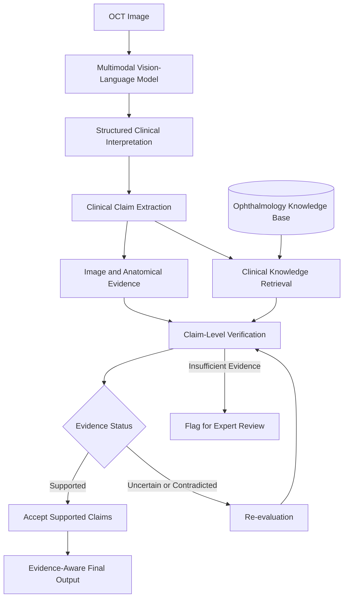
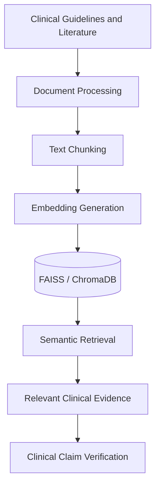

<div align="center">

# 👁️ TrustOCT

### A Hallucination-Aware Vision-Language Framework for Trustworthy OCT Interpretation

**Making medical AI more reliable through visual grounding, clinical evidence retrieval and claim-level verification.**

<br>


<br>

**Perception → Cognition → Reasoning → Verification**

*See the evidence. Verify the reasoning.*

</div>

---

## 📌 Overview

**TrustOCT** is a research-oriented multimodal AI framework designed to improve the reliability of Optical Coherence Tomography (OCT) image interpretation.

Modern Multimodal Large Language Models (MLLMs) can analyze medical images and generate detailed clinical explanations. However, they may produce confident diagnoses even when their visual observations, anatomical understanding or clinical reasoning are incorrect.

TrustOCT addresses this problem by introducing an **evidence-aware verification layer** that examines individual clinical claims before accepting the model's final interpretation.

Rather than asking only whether the final disease prediction is correct, TrustOCT investigates whether the underlying reasoning is supported by the OCT image and trusted ophthalmology knowledge.

> **Research Question:** Can claim-level, evidence-aware verification identify and reduce unsupported clinical reasoning in multimodal OCT interpretation?

---

## 🚨 Problem Statement

Existing AI-based OCT interpretation systems may suffer from four major limitations:

| Challenge | Description |
|:---|:---|
| Confident hallucinations | Models may generate incorrect findings with high confidence. |
| Right answer, wrong reasoning | A correct diagnosis may be accompanied by incorrect anatomical or clinical reasoning. |
| Anatomical misidentification | Models may confuse retinal layers, lesion locations or fluid types. |
| Unsupported explanations | Generated clinical explanations may not be grounded in the actual image or established medical evidence. |

Traditional OCT classifiers generally follow:

```text
OCT Image → Disease Prediction
```

TrustOCT proposes a more comprehensive approach:

```text
OCT Image
    ↓
Visual Perception
    ↓
Anatomical Cognition
    ↓
Clinical Reasoning
    ↓
Evidence Verification
    ↓
Evidence-Aware Output
```

---

## 🎯 Project Objectives

1. Analyze retinal OCT images using multimodal vision-language models.
2. Structure model-generated interpretations into perception, cognition and reasoning stages.
3. Extract individual visual, anatomical and clinical claims.
4. Retrieve relevant ophthalmology knowledge using Retrieval-Augmented Generation (RAG).
5. Verify claims using image evidence and retrieved clinical evidence.
6. Identify unsupported or contradictory claims.
7. Trigger re-evaluation or flag uncertain cases when sufficient evidence is unavailable.
8. Compare TrustOCT against baseline MLLM interpretation to evaluate its effectiveness.

---

## 🧠 Cognitive Reasoning Framework

TrustOCT is inspired by the hierarchical cognitive framework used in OCT-Bench.

<table>
<tr>
<th align="center">Stage</th>
<th align="center">Question</th>
<th align="left">Capabilities</th>
</tr>

<tr>
<td align="center"><b>01. Perception</b></td>
<td>What is visible?</td>
<td>
Image characteristics, morphological features, boundaries,
reflectivity, quantity and spatial orientation.
</td>
</tr>

<tr>
<td align="center"><b>02. Cognition</b></td>
<td>Where is the abnormality?</td>
<td>
Retinal layer identification, lesion classification,
anatomical localization and structural assessment.
</td>
</tr>

<tr>
<td align="center"><b>03. Reasoning</b></td>
<td>What does it clinically mean?</td>
<td>
Disease diagnosis, stage classification,
treatment-related reasoning and follow-up reasoning.
</td>
</tr>

<tr>
<td align="center"><b>04. Verification</b></td>
<td>Is the reasoning supported?</td>
<td>
Visual grounding, clinical evidence retrieval,
claim verification and contradiction detection.
</td>
</tr>
</table>

The **verification stage** is the central focus of TrustOCT.

---

## 🏗️ Proposed System Architecture



### How it works

**Step 1 — OCT Image Input**

The system receives an OCT scan and performs the required preprocessing.

**Step 2 — Initial MLLM Interpretation**

A pretrained vision-language model generates visual observations, anatomical findings and a possible clinical interpretation.

**Step 3 — Claim Extraction**

The generated interpretation is decomposed into individual, verifiable clinical claims.

**Step 4 — Evidence Retrieval**

The system gathers two forms of evidence:

- Image-grounded evidence from OCT images and available annotations.
- Clinical evidence retrieved from trusted ophthalmology literature.

**Step 5 — Claim Verification**

Each claim is evaluated against the available evidence and classified as supported, uncertain or contradicted.

**Step 6 — Re-evaluation**

When contradictions or unsupported claims are identified, the system can request a revised interpretation using the available evidence.

**Step 7 — Final Output**

The system produces an evidence-aware interpretation or flags the case when sufficient evidence is unavailable.

---

## 🔍 Claim-Level Verification

One of the main ideas behind TrustOCT is that the correctness of a final diagnosis does not guarantee the correctness of its explanation.

### Example

Suppose an MLLM generates the following interpretation:

> The OCT image shows intraretinal fluid and is consistent with diabetic macular edema.

TrustOCT extracts three claims:

| Claim | Evidence Required |
|:---|:---|
| Fluid is present. | OCT image evidence |
| The fluid is intraretinal. | Retinal layer and lesion localization |
| The findings are consistent with DME. | Retrieved clinical knowledge |

Each claim is verified independently.

The system can therefore identify situations where a final diagnosis appears plausible but one or more intermediate claims are incorrect or insufficiently supported.

---

## 📚 Clinical Knowledge Base and RAG

TrustOCT proposes a curated clinical knowledge base constructed using established ophthalmology references, including:

- American Academy of Ophthalmology (AAO) Preferred Practice Pattern guidelines.
- Consensus ophthalmology literature.
- Established ophthalmology references such as *Ryan's Retina*.

Relevant documents will be processed and indexed for semantic retrieval.

### RAG Pipeline



RAG helps verify whether a clinical relationship is supported by established medical knowledge.

**Important:** RAG alone cannot establish whether a specific abnormality is actually present in an OCT image. Image-grounded verification must be performed separately.

---

## 🩻 Image-Grounded Evidence

Visual verification uses OCT images and available dataset annotations.

Depending on the selected dataset, these may include:

- Disease labels
- Bounding boxes
- Segmentation masks
- Retinal layer annotations
- Lesion locations
- Clinical attributes

The verification system distinguishes between two questions:

| Image Verification | Clinical Verification |
|:---|:---|
| Is the feature visible in this scan? | Does medical evidence support the interpretation? |
| Is the lesion correctly localized? | Is the finding associated with the proposed disease? |
| Are the anatomical claims supported? | Are the clinical claims supported? |

Combining these forms of evidence is essential to the proposed verification process.

---

## 🩺 Structured Clinical Reasoning

TrustOCT uses structured clinical reasoning to organize the MLLM's interpretation.

```text
Visual Perception
       ↓
Anatomical Localization
       ↓
Clinical Correlation
       ↓
Final Interpretation
       ↓
Claim-Level Verification
```

This approach is related to medical chain-of-thought prompting.

However, generating a detailed explanation does not prove that the explanation is correct.

TrustOCT therefore adds an independent verification stage that evaluates the generated claims against available evidence.

---

## 🔬 TrustOCT vs OCT-Bench

TrustOCT is motivated by the limitations identified through hierarchical OCT evaluation.

| Feature | OCT-Bench | TrustOCT |
|:---|:---|:---|
| Primary purpose | Evaluate MLLM capabilities | Investigate output reliability |
| Main focus | Perception, cognition and reasoning | Evidence-aware verification |
| Output | Task-level evaluation results | Verified or flagged clinical claims |
| Failure analysis | Identifies task-level weaknesses | Identifies unsupported claims |
| Clinical RAG | Not its primary objective | Proposed evidence retrieval component |
| Contradiction handling | Measures model performance | Attempts to detect and address contradictions |

**OCT-Bench evaluates where models fail. TrustOCT investigates whether verification can identify and reduce those failures.**

---

## 🧪 Experimental Design

To evaluate the proposed framework, the project will compare two configurations.

### Baseline Model

```text
OCT Image → MLLM → Final Interpretation
```

### TrustOCT

```text
OCT Image
    ↓
MLLM
    ↓
Structured Reasoning
    ↓
Claim Extraction
    ↓
Image Evidence + Clinical RAG
    ↓
Claim Verification
    ↓
Re-evaluation / Abstention
    ↓
Final Output
```

### Proposed Evaluation Metrics

| Metric | Purpose |
|:---|:---|
| Final-answer accuracy | Measures the correctness of final predictions |
| Unsupported-claim rate | Measures claims lacking sufficient evidence |
| Contradiction rate | Measures claims conflicting with available evidence |
| Evidence consistency | Evaluates agreement between claims and supporting evidence |
| Perception accuracy | Measures basic visual understanding |
| Cognition accuracy | Measures anatomical understanding |
| Reasoning accuracy | Measures clinical reasoning performance |
| Abstention behavior | Evaluates how the system handles uncertainty |
| Inference latency | Measures additional verification overhead |

The exact verification metrics and ground-truth protocol will be finalized during implementation.

---

## 🛠️ Proposed Technology Stack

<div align="center">

| Component | Technology |
|:---|:---|
| Programming Language | Python |
| Deep Learning | PyTorch |
| Computer Vision | OpenCV, Pillow |
| Vision-Language Models | Hugging Face / Multimodal APIs |
| Clinical RAG | Embedding Models |
| Vector Database | FAISS / ChromaDB |
| Data Processing | Pandas, NumPy |
| Data Validation | Pydantic |
| Evaluation | Scikit-learn, Custom Metrics |
| Dashboard | Streamlit |

</div>

---

## 📂 Proposed Project Structure

```text
TrustOCT/
│
├── data/
│   ├── raw/
│   ├── processed/
│   └── annotations/
│
├── knowledge/
│   ├── documents/
│   └── vector_store/
│
├── src/
│   │
│   ├── data/
│   │   ├── preprocessing.py
│   │   └── schemas.py
│   │
│   ├── vision/
│   │   └── image_evidence.py
│   │
│   ├── reasoning/
│   │   ├── vlm.py
│   │   └── clinical_reasoning.py
│   │
│   ├── rag/
│   │   ├── indexer.py
│   │   └── retriever.py
│   │
│   ├── verification/
│   │   ├── claim_extractor.py
│   │   ├── verifier.py
│   │   └── contradiction.py
│   │
│   └── evaluation/
│       └── metrics.py
│
├── app/
│   └── streamlit_app.py
│
├── tests/
│
├── requirements.txt
├── .gitignore
└── README.md
```

*This is the planned repository structure and will be updated as implementation progresses.*

---

## 👥 Project Modules

<details>
<summary><b>Module 1 — Dataset and Computer Vision</b></summary>

<br>

- OCT dataset preparation
- Data preprocessing and normalization
- Image annotations
- Retinal layer and lesion visualization
- Image-grounded evidence preparation

</details>

<details>
<summary><b>Module 2 — Clinical Knowledge and RAG</b></summary>

<br>

- Clinical knowledge-base preparation
- Guideline processing
- Document chunking and embeddings
- Vector database integration
- Clinical evidence retrieval

</details>

<details>
<summary><b>Module 3 — MLLM and Clinical Reasoning</b></summary>

<br>

- Vision-language model integration
- OCT image interpretation
- Structured clinical reasoning
- Perception, cognition and reasoning experiments
- Baseline model evaluation

</details>

<details>
<summary><b>Module 4 — Trustworthiness and Evaluation</b></summary>

<br>

- Clinical claim extraction
- Claim-level verification
- Contradiction detection
- Hallucination analysis
- Evaluation metrics
- Dashboard development

</details>

---

## 💡 Intended Research Contribution

TrustOCT investigates **claim-level verification of multimodal OCT reasoning**.

Rather than simply combining multiple models or relying on the confidence of a final prediction, the framework aims to verify intermediate visual, anatomical and clinical claims using separate evidence sources.

The central hypothesis is that evidence-aware verification can help identify unsupported reasoning and improve the reliability of multimodal OCT interpretation.

This hypothesis will be evaluated experimentally against baseline MLLM performance.

---

## 🚀 Future Scope

- Adaptive verification for uncertain cases
- Specialized multi-agent verification
- Visual grounding and explainability
- Improved uncertainty calibration
- Clinician-in-the-loop evaluation
- 3D volumetric OCT analysis
- Extension to other medical imaging modalities

---

## 🌍 Sustainable Development Goal

<div align="center">

### 🏥 SDG 3 — Good Health and Well-being

TrustOCT aligns with SDG 3 through research into safer and more reliable AI-assisted medical image interpretation.

</div>

---

## ⚠️ Limitations

- Clinical retrieval quality depends on the accuracy and coverage of the knowledge base.
- Image-grounded verification depends on the availability and quality of visual annotations.
- Model-generated confidence is not equivalent to calibrated clinical certainty.
- Verification itself can introduce errors and must be evaluated independently.
- Clinical claims require appropriate expert validation.
- Experimental performance cannot automatically be generalized to real-world clinical use.

---

## ⚕️ Medical Disclaimer

**TrustOCT is an academic research prototype.**

It is not a certified medical device and is not intended for independent clinical diagnosis, treatment selection or patient management.

---

<div align="center">

### 👁️ TrustOCT

**See the evidence. Verify the reasoning.**

<sub>Multimodal AI • Medical Imaging • Trustworthy AI</sub>

</div>
