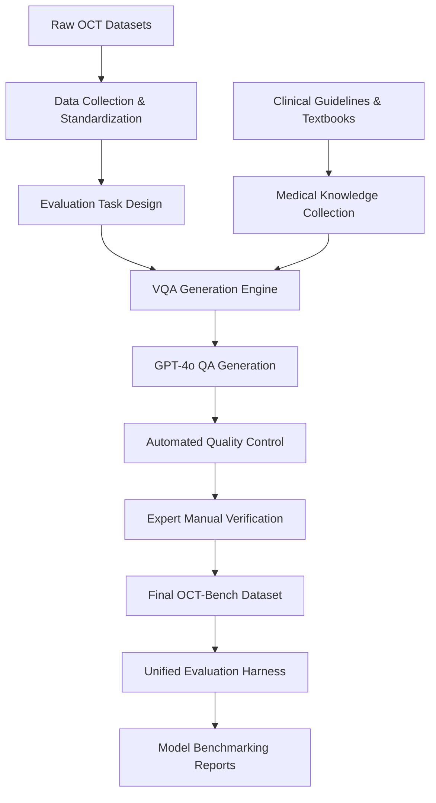

# Summary and Implementation Analysis of OCT-Bench

This document provides a detailed summary of the paper **"Can Multimodal Large Language Models Understand OCT?"**, outlining the proposed benchmark, its evaluation taxonomy, pipeline steps, and identifying the specific software components required to build or replicate this system.

---

## 1. Overview of the Proposed Benchmark (OCT-Bench)

**OCT-Bench** is a comprehensive evaluation benchmark designed to assess the capabilities of Multimodal Large Language Models (MLLMs) in understanding Optical Coherence Tomography (OCT) images. 

Unlike generic vision-language benchmarks or simple classification datasets, OCT-Bench reflects the actual clinical workflow. It evaluates models along a **hierarchical cognitive pathway** from low-level visual perception to high-level clinical reasoning, comprising **10,076 high-quality multiple-choice questions (MCQs)** based on **4,137 OCT images** across **7 public datasets**.



---

## 2. The Hierarchical Taxonomy of Tasks

The benchmark categorizes OCT understanding into three major cognitive dimensions, subdivided into 9 capability groups and 20 fine-grained tasks:

| Dimension | Capability Group | Task ID | Task Name | Description & Objective |
| :--- | :--- | :--- | :--- | :--- |
| **Perception** | **A1: Morphological Perception** | T01 | Modality Perception | Identify the medical imaging modality (e.g., OCT, MRI, CT, Ultrasound). |
| | | T02 | Annotation Recognition | Recognize features of annotations (e.g., color of bounding boxes, text labels). |
| | | T03 | Morphological Description | Describe the morphology or shape of lesions (e.g., dot-like, mass-like, linear). |
| | | T04 | Boundary Feature Recognition | Identify boundary characteristics of abnormalities (e.g., smooth, irregular). |
| | | T05 | Reflectivity Analysis | Evaluate tissue/lesion reflectivity characteristics (e.g., hyperreflective, hyporeflective). |
| | **A2: Spatial & Quantitative Perception** | T06 | Quantity Estimation | Estimate count of annotated regions or structures in the image. |
| | | T07 | Scale Perception | Compare the size or area between different annotation boxes or structures. |
| | | T08 | Spatial Orientation Recognition | Describe relative positions of annotated features (e.g., Upper-Left, Lower-Right). |
| **Cognition** | **B1: Anatomical Cognition** | T09 | Region Identification | Identify macro anatomical regions highlighted in the image (e.g., Vitreous, Retina, Choroid). |
| | | T10 | Layer Identification | Identify specific fine retinal layers (e.g., ILM, OPL, IS/OS, RPE). |
| | | T11 | Inter-layer Relationship | Determine the spatial relationship between layers (e.g., layer immediately below/above another). |
| | **B2: Pathological Cognition** | T12 | Lesion Classification | Classify lesions based on annotations (e.g., IRF, SHRM, PED, SRF). |
| | | T13 | Structural Status Assessment | Evaluate the structural integrity of tissues (e.g., macular status: intact, disrupted). |
| | | T14 | Lesion Localization | Determine the anatomical layer/location of a lesion (e.g., Inner retina, Outer retina). |
| | **B3: Clinical Association** | T15 | Disease Association | Link fluid accumulation or structures to typical associated diseases (e.g., CSC, AMD). |
| | | T16 | Functional Impact Assessment | Link anatomical anomalies to potential functional visual deficits (e.g., central vision loss). |
| **Reasoning** | **C1: Disease Reasoning** | T17 | Disease Diagnosis | Diagnose the pathology from the visual evidence (e.g., AMD, CSC, DME, RVO). |
| | | T18 | Stage Classification | Determine the clinical stage or severity of the disease (e.g., Stage 1-4 macular holes). |
| | **C2: Therapeutic Decision** | T19 | Treatment Planning | Select the best diagnosis-treatment pairing (e.g., DME -> anti-VEGF). |
| | **C3: Prognostic Management** | T20 | Follow-up Adjustment | Determine management/treatment modifications based on disease persistence and patient history. |

---

## 3. The 5-Stage Benchmark Construction Pipeline

1. **Step 1: Data Collection**: Retrieve and process raw images from 7 source datasets: *OCT5k, OIMHS, OCT-C8, AMD-SD, OCTDL, MMC-AMD, and GOALS*. Heterogeneous annotation formats (bounding boxes, masks, classifications) are parsed and normalized.
2. **Step 2: Evaluation Task Design**: Define instructions, scopes, and target capabilities for all 20 tasks, ensuring clean division between perception, cognition, and reasoning.
3. **Step 3: Medical Knowledge Collection**: Extract clinical rules from references (such as AAO guidelines, CMA consensus statements, and classic OCT textbooks). Format these rules as task-specific constraints for generation.
4. **Step 4: VQA Generation**: Prompt GPT-4o with the task descriptions, standardized image annotations, and medical knowledge text, directing the model to generate multi-choice questions with one correct answer and three plausible distractors.
5. **Step 5: Expert Quality Control**: Two-stage validation:
   - *Automated checks*: LLM verification of question logic, answer uniqueness, and syntax.
   - *Manual checks*: Ophthalmic domain experts verify clinical accuracy, visual answerability, and correct matching of capability levels.

---

## 4. Component Checklist for Implementation

To implement and execute the OCT-Bench pipeline, the following software components and sub-modules must be built:

### 1. Data Acquisition & Processing Pipeline
- **Dataset Adapters**: Independent parser scripts for each of the 7 source datasets (`OCT5k`, `OIMHS`, etc.) to parse native formats (coco-json, matlab files, csv, or png masks) into a unified format.
- **Unified Schema Exporter**: A serialisation utility that saves unified data as:
  ```json
  {
    "image_id": "unique_id",
    "image_path": "path/to/image.png",
    "annotations": {
      "bboxes": [{"coords": [x1, y1, x2, y2], "label": "PED", "color": "purple"}],
      "segmentations": [{"mask_path": "mask.png", "label": "Choroid"}],
      "classification": "AMD"
    }
  }
  ```
- **Image Markup Renderer**: A CV2/Pillow utility to crop annotated boxes, highlight layers/regions, or generate visual cues matching task instructions (e.g., drawing numbered boxes or drawing specific colors for region identifying questions).

### 2. Medical Knowledge Management Module
- **Knowledge Store / Vector DB**: A curated database containing ophthalmic guidelines, textbook snippets, and consensus rules grouped by disease category (CSC, AMD, DME, Macular Hole).
- **Rule Selector / Retriever**: A script to retrieve rules mapping to the parsed labels of an image (e.g., if an image is labeled as "Macular Hole", retrieve staging criteria for MH).

### 3. VQA Generation Engine
- **Prompt Manager**: Template engine loaded with dedicated generation instructions for the 20 task types.
- **LLM Pipeline Runner**: Script that handles:
  - Batch inputs to MLLM APIs (e.g., GPT-4o API client).
  - Injecting text descriptions of coordinates, spatial positions, and clinical labels alongside the medical rules retrieved.
  - Rate limiting, error handling, and structured response parsing (e.g., using Pydantic schemas to guarantee JSON formatting containing `question`, `options`, `answer`, `explanation`).

### 4. Automated Quality Control & Expert Review Webapp
- **Self-Check Validator**: An automated script prompting an LLM to evaluate:
  - Language biases (is the question answerable *without* the image?).
  - Option validation (is there exactly one correct answer?).
- **Expert Review Dashboard**: A simple local web interface (e.g., built using Streamlit, Gradio, or Next.js) displaying the OCT image, the visual highlights, the generated question, options, correct answer, and explanation. Provides buttons for experts to **Approve**, **Edit**, or **Reject/Delete** questions.

### 5. Unified Model Evaluation Harness
- **Model Adapter Layer**: Interface wraps for executing predictions across different model families:
  - *Proprietary APIs* (Gemini API, OpenAI API, Anthropic API, etc.).
  - *Hugging Face / vLLM API* (for open-source general-purpose and medical-domain models).
- **Inference Coordinator**: Orchestrates running the benchmark, loading questions, feeding correct image-question pairs, and enforcing strict response formats (e.g., zero-shot prompting models to return exactly one character from `[A, B, C, D]`).
- **Metric Calculator & Reporter**: A parser that:
  - Scores responses against the ground-truth answers.
  - Handles invalid outputs (counts them as incorrect).
  - Computes sub-scores for the 3 major dimensions (Perception, Cognition, Reasoning) and individual tasks (T01 - T20).
  - Generates analytical visualization plots (such as radar charts for models, bar charts, and tabular results).
